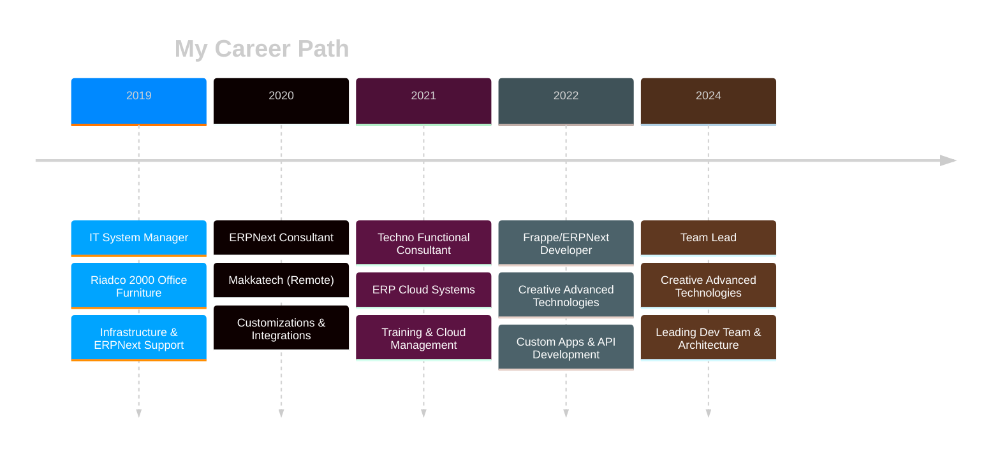

<div align="center">

<!-- Dynamic Header -->


<!-- Animated Wave -->


</div>

<!-- Intro Section -->
<h2>
  
  Hey there! Welcome to my digital workspace
</h2>


```yaml
name: Ahmed Emam
located_in: Dubai, UAE
current_job: Frappe Development Team Lead
company: Creative Advanced Technologies

education:
  - Bachelor's in Management Information Systems

fields_of_interests:
  - ERP Systems
  - Business Process Automation
  - API Development & Integration
  - Cloud Architecture
  - Team Leadership

currently_learning:
  - Advanced System Architecture
  - AI Integration with ERPNext

hobbies:
  - Open Source Contributing
  - Technical Writing
  - Problem Solving
```

<br clear="both">

---

<!-- Stats Section -->
<h2>
  
  GitHub Analytics
</h2>

<p align="center">
  <a href="https://github.com/ahmedemamhatem">
    
    
  </a>
</p>

<p align="center">
  
</p>

<p align="center">
  
</p>

<!-- Activity Graph -->
<p align="center">
  
</p>

---

<!-- Tech Stack -->
<h2>
  
  Tech Arsenal
</h2>

<div align="center">

### Languages & Frameworks
<p>
  
</p>

### ERP & Business Platforms
<p>
  
  
  
</p>

### Database & Storage
<p>
  
  
</p>

### DevOps & Cloud
<p>
  
</p>

### Tools & Platforms
<p>
  
  
  
  
</p>

</div>

---

<!-- Experience Section -->
<h2>
  
  Professional Journey
</h2>

<div align="center">



</div>

<br>

<table align="center">
<tr>
<td align="center" width="50%">

### Current Role


**Key Responsibilities:**
- 👥 Lead team of Frappe developers
- 🏗️ Architect enterprise solutions
- 🤝 Client relationship management
- 📋 Project planning & delivery
- 🎯 Code reviews & mentoring

</td>
<td align="center" width="50%">

### Core Expertise


**Specializations:**
- 🔧 ERPNext Customization
- 🌐 REST API Development
- 📊 Business Intelligence
- 🔄 System Integration
- 📦 Module Development

</td>
</tr>
</table>

---

<!-- Projects Section -->
<h2>
  
  Featured Projects
</h2>

<div align="center">

<a href="https://github.com/ahmedemamhatem/crm_integration">
  
</a>
<a href="https://github.com/ahmedemamhatem/expenses_management">
  
</a>

</div>

<br>

<details>
<summary><b>🔥 View All Key Projects</b></summary>
<br>

| Project | Description | Tech Stack | Status |
|:--------|:------------|:-----------|:------:|
| **CRM Integration** | WhatsApp Business integration with ERPNext - automated messaging, document sharing, customer communication | `Python` `Frappe` `WhatsApp API` |  |
| **Expenses Management** | Complete expense tracking system with multi-level approval workflows | `Python` `Frappe` `ERPNext` |  |
| **ZATCA E-Invoicing** | Saudi Arabia tax compliance & e-invoicing implementation | `Python` `XML` `Cryptography` |  |
| **Salla Integration** | E-commerce sync between Salla platform and ERPNext | `REST API` `Webhooks` `Python` |  |
| **Custom Manufacturing** | Industry-specific manufacturing module with advanced BOM | `Python` `JavaScript` `MariaDB` |  |
| **HR Automation** | Automated payroll processing & attendance management | `Python` `Frappe` `HRMS` |  |

</details>

---

<!-- Industry Section -->
<h2>
  
  Industry Expertise
</h2>

<div align="center">

<table>
<tr>
<td align="center" width="25%">
<br>
<b>Finance</b><br>
<sub>GL, AR, AP, Budgeting</sub>
</td>
<td align="center" width="25%">
<br>
<b>Inventory</b><br>
<sub>Stock, Batch, Serial</sub>
</td>
<td align="center" width="25%">
<br>
<b>Sales</b><br>
<sub>Orders, Invoicing, CRM</sub>
</td>
<td align="center" width="25%">
<br>
<b>Manufacturing</b><br>
<sub>BOM, Work Orders, QC</sub>
</td>
</tr>
<tr>
<td align="center">
<br>
<b>HR & Payroll</b><br>
<sub>Attendance, Leave, Salary</sub>
</td>
<td align="center">
<br>
<b>Projects</b><br>
<sub>Tasks, Timesheets, Billing</sub>
</td>
<td align="center">
<br>
<b>E-commerce</b><br>
<sub>Integration, Sync, Orders</sub>
</td>
<td align="center">
<br>
<b>Retail & POS</b><br>
<sub>Multi-location, Loyalty</sub>
</td>
</tr>
</table>

</div>

---

<!-- Certifications -->
<h2>
  
  Certifications
</h2>

<div align="center">


</div>

---

<!-- Connect Section -->
<h2>
  
  Let's Connect
</h2>

<div align="center">

<a href="https://www.linkedin.com/in/ahmed-emam-983606132">
  
</a>
<a href="mailto:ahmedemamhatem@gmail.com">
  
</a>
<a href="https://wa.me/201289988964">
  
</a>
<a href="https://t.me/ahmedemamhatem">
  
</a>
<a href="https://github.com/ahmedemamhatem">
  
</a>

<br><br>

<!-- Profile Views -->


<br><br>

<!-- Quote -->


</div>

---

<div align="center">

### 💭 Philosophy

> *"Building robust ERP solutions that transform businesses and drive growth through technology innovation."*

<br>

<!-- Snake Animation -->


<br>

<!-- Footer -->


</div>
