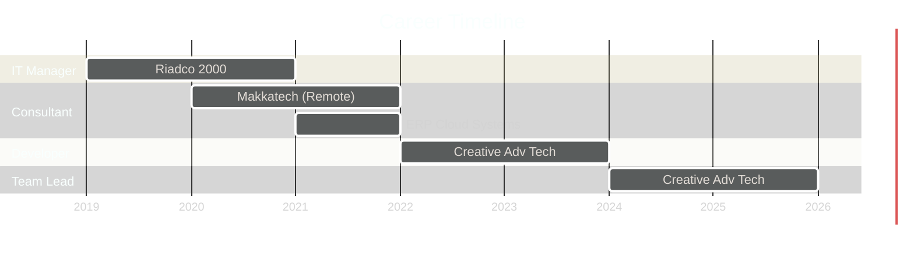

<div align="center">

<!-- Animated Matrix Header -->


<!-- Animated Typing -->
<a href="https://git.io/typing-svg">
  
</a>

<!-- Animated Social Badges -->
<p>
<a href="https://www.linkedin.com/in/ahmed-emam-983606132"></a>
<a href="mailto:ahmedemamhatem@gmail.com"></a>
<a href="https://wa.me/201289988964"></a>
<a href="https://t.me/ahmedemamhatem"></a>
</p>

<!-- Animated Visitors Counter -->


</div>

<!-- Animated Divider -->


<!-- About Section with Animation -->
<h2>
  
  
</h2>

<table>
<tr>
<td width="50%">


</td>
<td width="50%">

```javascript
const ahmed = {
  title: "Senior Frappe Developer & Team Lead",
  location: "Dubai, UAE 🇦🇪",
  company: "Creative Advanced Technologies",

  expertise: {
    erp: ["ERPNext", "Frappe Framework"],
    backend: ["Python", "REST APIs", "MariaDB"],
    frontend: ["JavaScript", "HTML/CSS", "Jinja2"],
    devops: ["Docker", "Git", "Linux", "AWS"]
  },

  experience: "5+ years in IT Industry",

  passion: "Building scalable ERP solutions",

  currently: {
    learning: "AI Integration with ERPNext",
    working: "Enterprise Solutions Architecture"
  },

  motto: "Code • Lead • Innovate"
};
```

</td>
</tr>
</table>

<!-- Animated Divider -->


<!-- GitHub Stats Section -->
<h2>
  
  
</h2>

<p align="center">
  
  
</p>

<p align="center">
  
</p>

<!-- Trophy Section -->
<p align="center">
  
</p>

<!-- Activity Graph -->
<p align="center">
  
</p>

<!-- Animated Divider -->


<!-- Tech Stack Section -->
<h2>
  
  
</h2>

<div align="center">

<!-- Languages -->
<h3>
   Languages & Frameworks
</h3>
<p>
  
</p>

<!-- ERP & Databases -->
<h3>
   ERP & Databases
</h3>
<p>
  
  
  
</p>

<!-- DevOps & Cloud -->
<h3>
   DevOps & Cloud
</h3>
<p>
  
</p>

<!-- Tools -->
<h3>
   Tools & Platforms
</h3>
<p>
  
  
  
  
</p>

</div>

<!-- Animated Divider -->


<!-- Experience Section -->
<h2>
  
  
</h2>

<div align="center">



</div>

<br>

<div align="center">

<table>
<tr>
<td align="center" width="33%">

### 🚀 Current Role

<br><br>
**Creative Advanced Technologies**
<br>Dubai, UAE
<br><br>


</td>
<td align="center" width="33%">

### 💼 Experience

<br><br>
**4+ Years ERPNext**
<br>Enterprise Solutions
<br><br>


</td>
<td align="center" width="33%">

### 🎯 Focus

<br><br>
**Scalable Solutions**
<br>Team Leadership
<br><br>


</td>
</tr>
</table>

</div>

<!-- Animated Divider -->


<!-- Projects Section -->
<h2>
  
  
</h2>

<div align="center">

<a href="https://github.com/ahmedemamhatem/crm_integration">
  
</a>
<a href="https://github.com/ahmedemamhatem/expenses_management">
  
</a>

</div>

<br>

<details>
<summary>
  <b>🔥 Click to View All Projects</b>
</summary>
<br>

<div align="center">

| # | Project | Description | Stack | Status |
|:-:|:--------|:------------|:------|:------:|
| 01 | **CRM Integration** | WhatsApp Business API integration with ERPNext | `Python` `Frappe` `WhatsApp API` |  |
| 02 | **Expenses Management** | Multi-level approval expense tracking system | `Python` `Frappe` `ERPNext` |  |
| 03 | **ZATCA E-Invoicing** | Saudi Arabia tax compliance implementation | `Python` `XML` `Cryptography` |  |
| 04 | **Salla Integration** | E-commerce platform sync with ERPNext | `REST API` `Webhooks` `Python` |  |
| 05 | **Custom Manufacturing** | Advanced BOM & production planning | `Python` `JavaScript` `MariaDB` |  |
| 06 | **HR Automation** | Automated payroll & attendance system | `Python` `Frappe` `HRMS` |  |
| 07 | **POS Customization** | Multi-location retail management | `JavaScript` `Python` `ERPNext` |  |
| 08 | **Barcode Solutions** | Label printing & inventory tracking | `Python` `ZPL` `ERPNext` |  |

</div>

</details>

<!-- Animated Divider -->


<!-- Industry Expertise -->
<h2>
  
  
</h2>

<div align="center">

<table>
<tr>
<td align="center" width="20%">
<br>
<b>Finance</b><br>
<sub>GL • AR • AP • Budgets</sub>
</td>
<td align="center" width="20%">
<br>
<b>Inventory</b><br>
<sub>Stock • Batch • Serial</sub>
</td>
<td align="center" width="20%">
<br>
<b>Sales</b><br>
<sub>CRM • Orders • Invoices</sub>
</td>
<td align="center" width="20%">
<br>
<b>Manufacturing</b><br>
<sub>BOM • WO • QC</sub>
</td>
<td align="center" width="20%">
<br>
<b>HR</b><br>
<sub>Payroll • Leave • Attendance</sub>
</td>
</tr>
<tr>
<td align="center">
<br>
<b>Projects</b><br>
<sub>Tasks • Time • Billing</sub>
</td>
<td align="center">
<br>
<b>E-commerce</b><br>
<sub>Integration • Sync</sub>
</td>
<td align="center">
<br>
<b>Retail</b><br>
<sub>POS • Multi-store</sub>
</td>
<td align="center">
<br>
<b>API</b><br>
<sub>REST • Webhooks</sub>
</td>
<td align="center">
<br>
<b>Automation</b><br>
<sub>Workflows • Scripts</sub>
</td>
</tr>
</table>

</div>

<!-- Animated Divider -->


<!-- Certifications -->
<h2>
  
  
</h2>

<div align="center">


</div>

<!-- Animated Divider -->


<!-- Weekly Coding Stats -->
<h2>
  
  
</h2>

<div align="center">

<!--START_SECTION:waka-->
```text
Python       ████████████████████░░░░░   80.00 %
JavaScript   ████░░░░░░░░░░░░░░░░░░░░░   15.00 %
SQL          █░░░░░░░░░░░░░░░░░░░░░░░░   03.00 %
Other        ░░░░░░░░░░░░░░░░░░░░░░░░░   02.00 %
```
<!--END_SECTION:waka-->

</div>

<!-- Animated Divider -->


<!-- Connect Section -->
<h2>
  
  
</h2>

<div align="center">

<a href="https://www.linkedin.com/in/ahmed-emam-983606132">
  
</a>
<br><br>
<a href="mailto:ahmedemamhatem@gmail.com">
  
</a>
<br><br>
<a href="https://wa.me/201289988964">
  
</a>
<br><br>
<a href="https://t.me/ahmedemamhatem">
  
</a>

<br><br>

<!-- Random Dev Quote -->


</div>

<!-- Animated Divider -->


<!-- Footer -->
<div align="center">

<h3>💭 My Philosophy</h3>

> *"Building robust ERP solutions that transform businesses and drive exponential growth through innovative technology."*

<br>

<!-- Snake Animation -->
<picture>
  <source media="(prefers-color-scheme: dark)" srcset="https://raw.githubusercontent.com/platane/snk/output/github-contribution-grid-snake-dark.svg">
  <source media="(prefers-color-scheme: light)" srcset="https://raw.githubusercontent.com/platane/snk/output/github-contribution-grid-snake.svg">
  
</picture>

<br><br>

<!-- Spotify Now Playing (Optional) -->


<br><br>

<!-- Profile Views Counter -->


<br><br>

<!-- Animated Thank You -->


<br>

<!-- Animated Footer Wave -->


</div>
