

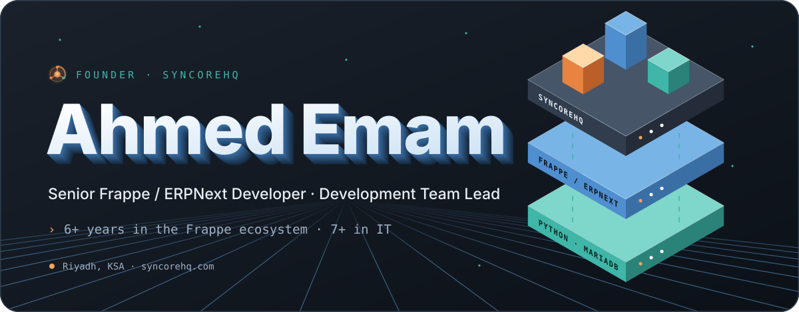

 

Certified ERPNext specialist and development team lead — **6+ years in the Frappe ecosystem, 7+ in IT**. I work across the full delivery lifecycle: requirements, custom app architecture, API integration, deployment and post-go-live support, for clients in Saudi Arabia, the UAE and Egypt. Currently **Senior Frappe Developer at Hawsabah**, Riyadh, and founder of **[SyncoreHQ](https://syncorehq.com)**, where I build an AI financial auditor, a business-management ERP and a wallet app for money-service companies on one core.

 

<a href="https://syncorehq.com">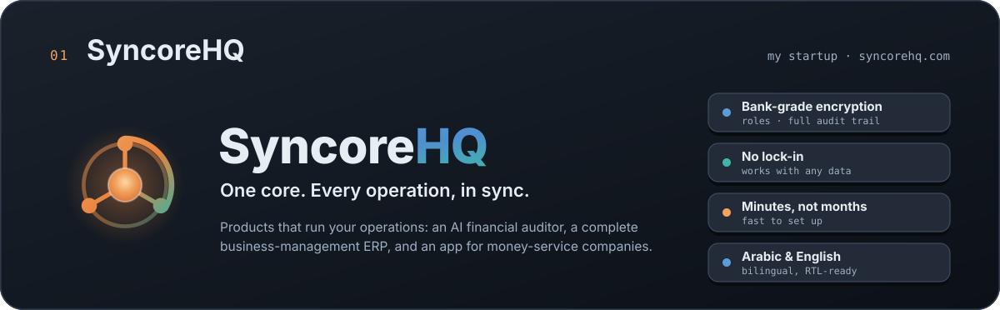</a>

  <a href="https://syncorehq.com/audit">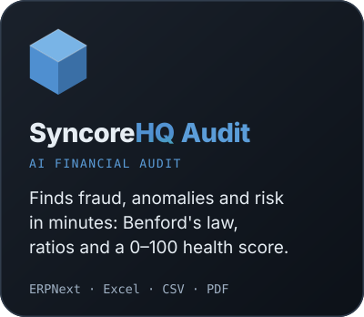</a>
  <a href="https://syncorehq.com/erp">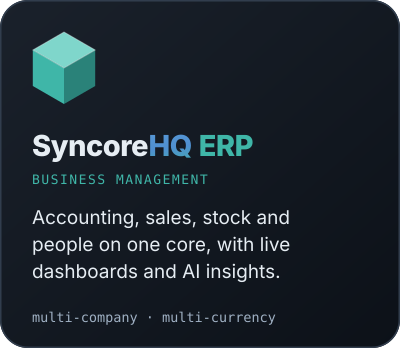</a>
  <a href="https://syncorehq.com/wallet">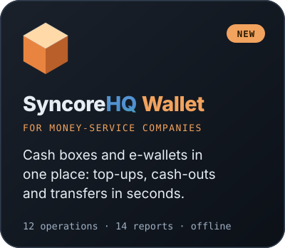</a>

 

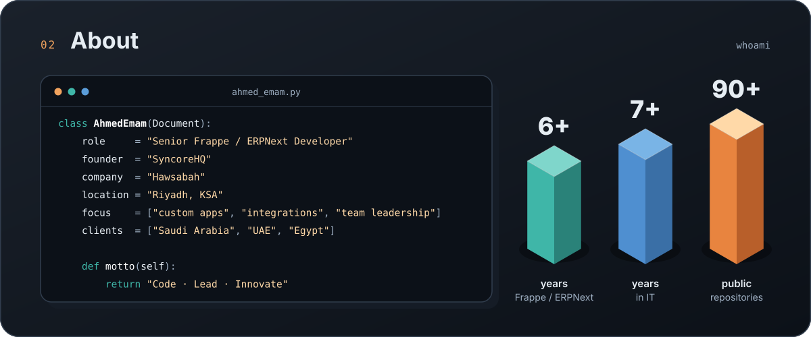

  

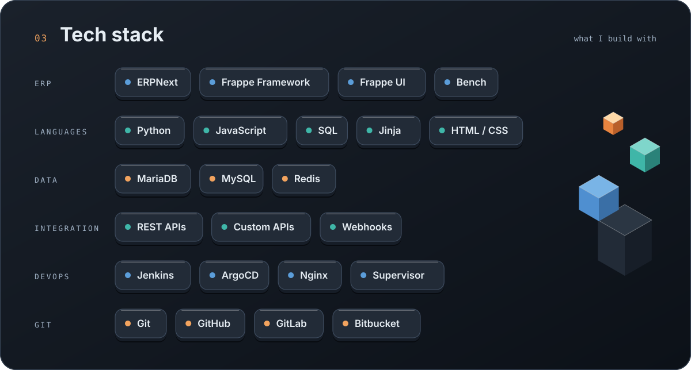

  

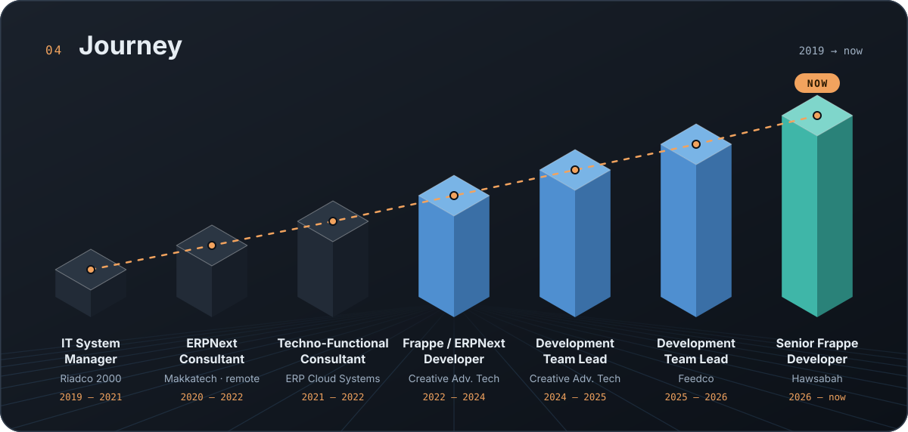

  

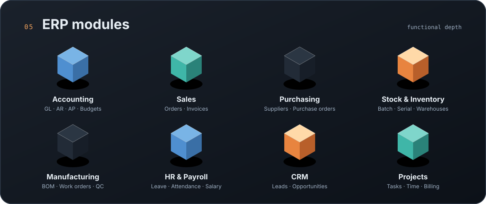

  

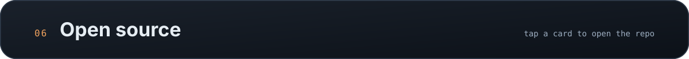

  <a href="https://github.com/accurate-systems/BioTime-API-Integration">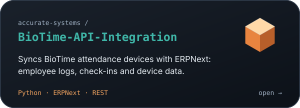</a>
  <a href="https://github.com/ahmedemamhatem/frappe-client">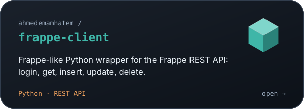</a>
  <a href="https://github.com/ahmedemamhatem/frappe_offline">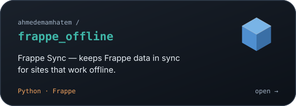</a>
  <a href="https://github.com/ahmedemamhatem/hr_system">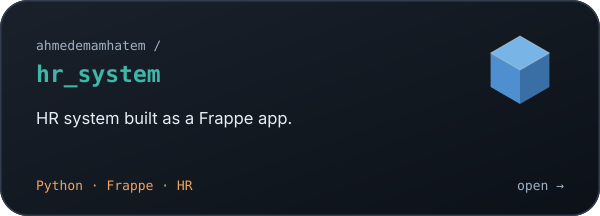</a>
  <a href="https://github.com/ahmedemamhatem/project_management">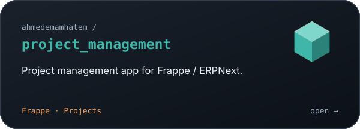</a>
  <a href="https://github.com/ahmedemamhatem/timesheet_payroll">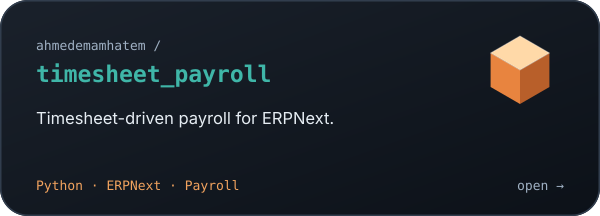</a>

<b>Client work in production</b>

 

| Project | What it does | Stack |
|:--|:--|:--|
| **ZATCA E-Invoicing** | Saudi Arabia tax-compliance implementation | `Python` `XML` `Cryptography` |
| **Salla Integration** | E-commerce platform sync with ERPNext | `REST API` `Webhooks` `Python` |
| **CRM Integration** | WhatsApp Business API integration with ERPNext | `Python` `Frappe` `WhatsApp API` |
| **Expenses Management** | Multi-level approval expense tracking | `Python` `Frappe` `ERPNext` |
| **Custom Manufacturing** | Advanced BOM & production planning | `Python` `JavaScript` `MariaDB` |
| **HR Automation** | Automated payroll & attendance | `Python` `Frappe` `HRMS` |
| **POS Customization** | Multi-location retail management | `JavaScript` `Python` `ERPNext` |
| **Barcode Solutions** | Label printing & inventory tracking | `Python` `ZPL` `ERPNext` |

 

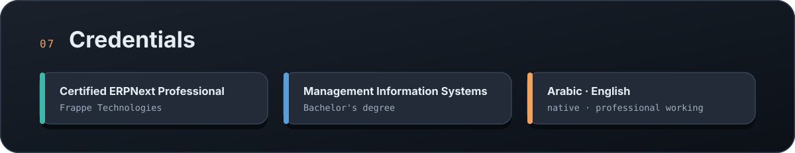

  

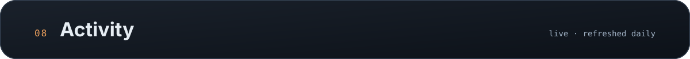

  

  

 

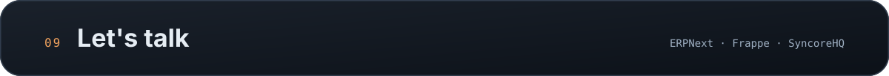

  
  
  
  
  

 

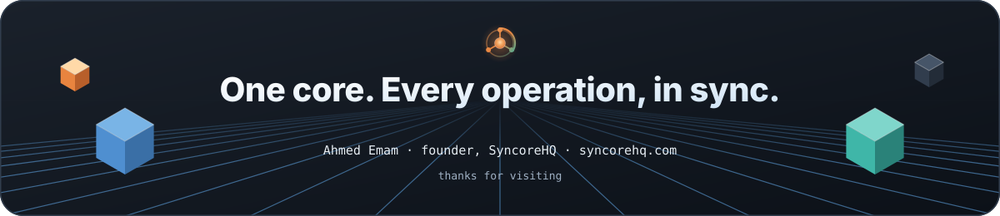
